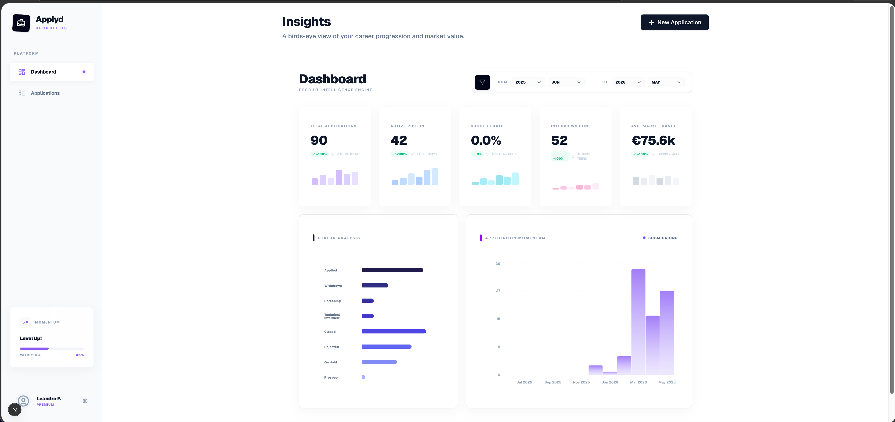
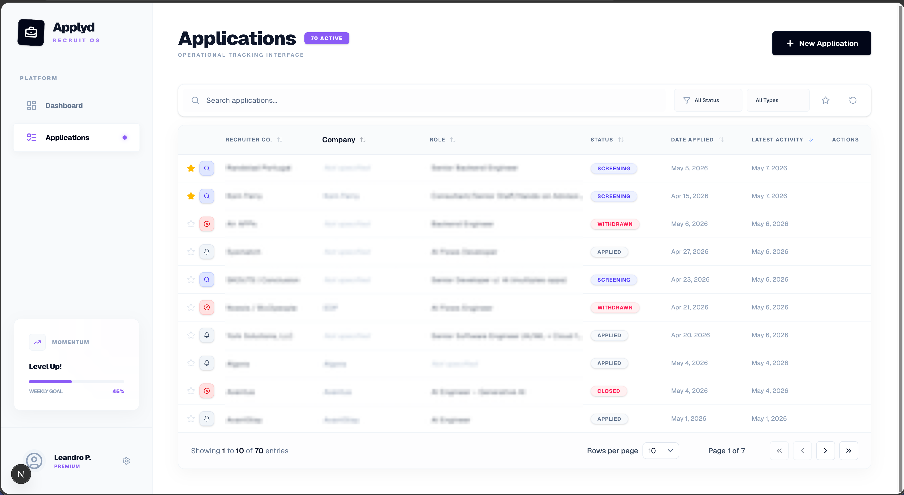
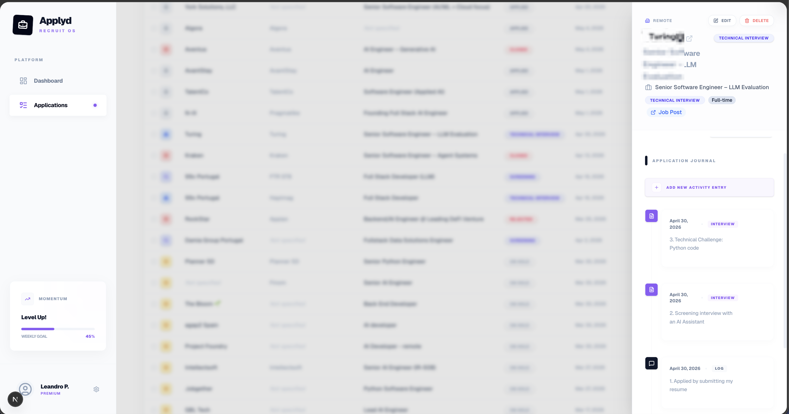

# Applyd — High-Density Job Application Tracker



**Applyd** is a high-density dashboard designed for tech professionals to manage and track job applications with surgical precision. Unlike generic spreadsheets or cloud platforms, Applyd offers a powerful, "local-first" interface focused on productivity, deep technical tracking, and total privacy.

This project is offered an integral part of the course:

🚀 **[International Job Interview Mastery for Tech Professionals - link 1](https://bit.ly/jobinterviewmastery)**

🚀 **[International Job Interview Mastery for Tech Professionals - link 2](https://www.udemy.com/course/international-job-interview-mastery-for-tech-professionals/?referralCode=55CC8B244F35504A079B)**

---

## 🔒 "Local-First" Privacy & Portability

Unlike other job tracking tools, Applyd was built with the philosophy that **your data belongs to you**. 

- **No Cloud Dependency:** There is no online database sharing your information.
- **SQLite Persistence:** The project uses a local SQLite database file.
- **Automatic Sync:** By defining an **absolute path** in your `DATABASE_URL`, you can keep your database in a synced folder (e.g., Google Drive, OneDrive, or Dropbox) for automatic backups and seamless cross-machine work without third-party access.

---

## ✨ Key Features

### 📊 Intelligent Dashboard
The Dashboard provides a macro view of your job market health.

- **Automatic Calculations:** Processes conversion rates between stages (e.g., Applied -> Interview).
- **Salary Tracking:** Native support for gross/net salary conversions across different periods (hour, day, month, year).
- **Modern Visualization:** Built with **Tailwind CSS v4** for a premium, high-performance look and feel.

### 📝 Application Management
A high-density table that allows managing dozens of processes simultaneously.

- **Interview Timeline (JSON):** A flexible field to record every interaction (Steps or Contacts) chronologically.

- **Interactive UI:** Supports **dynamic column resizing** (drag header edges) and advanced filtering by company, role, or recruiter.
- **Form Validation:** Robust data entry powered by **React Hook Form** and **Zod**.

---

## 🛠️ Tech Stack

- **Frontend:** Next.js 16 (App Router)
- **Styling:** Tailwind CSS v4 & shadcn/ui
- **ORM:** Prisma v6
- **Database:** SQLite (Local)
- **Validation:** Zod

---

## 🚀 Setup & Running

### 1. Prerequisites
- Node.js (v18+)
- npm

### 2. Configuration
Copy the template environment file and adjust the `DATABASE_URL` to your preference:

```bash
cp .env.example .env
```

In your `.env` file, you **MUST** define the `DATABASE_URL`. Use an absolute path for sync capabilities:

```env
# Example for macOS/Linux
DATABASE_URL="file:/Users/YOUR_USER/Path/To/Your/SyncFolder/dev.db"

# Example for Windows
DATABASE_URL="file:C:/Users/YOUR_USER/Path/To/Your/SyncFolder/dev.db"

```

### 3. Installation & Database Setup

Install dependencies and run Prisma migrations to initialize your local database:

```bash
npm install
npx prisma migrate dev

```

### 4. Run the Application

```bash
npm run dev

```

The application will be available at `http://localhost:3000`.

---

## 🤝 Contributions (Open Source)

This is an open project and contributions are very welcome! If you have an idea for a new feature or found a bug:

1. **Fork** the project.
2. Create a **Branch** (`git checkout -b feature/NewFeature`).
3. **Commit** your changes (`git commit -m 'Add: New feature'`).
4. **Push** to the Branch and open a **Pull Request**.

---

## ⚖️ License

This project is licensed under a custom license:

* **Personal & Educational Use:** Free to use, modify, and study.
* **Contributions:** Code improvements through PRs are encouraged.
* **Commercial Use:** **Prohibited.** This software may not be commercialized, sold, or redistributed as part of paid packages by third parties.

Licensed under CC BY-NC 4.0. See LICENSE file for details.

Developed with ❤️ by [Leandro Passos](https://github.com/leandropassos).
